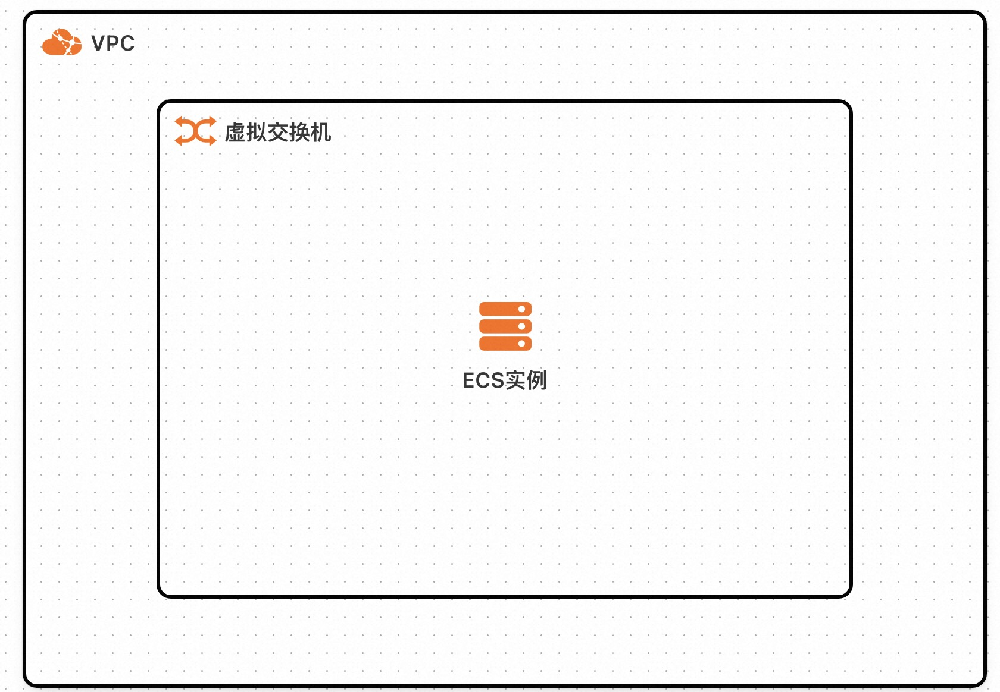

# 服务模板说明文档

## 服务说明

**简单描述服务的功能和用途。**  
例如：  
_（服务功能描述，如“WordPress 是一款免费开源的 CMS，适用于创建和管理各种类型的网站。”）_

_（服务快速上手链接或文档，如果有的话）_

## 服务架构

此服务模板构建出的服务的部署架构为单机ecs部署。



## 计费说明
通过此服务模板构建服务不产生费用。  
用户部署构建出的服务时，资源费用主要涉及：
- 所选ECS实例规格
- 磁盘容量
- 公网带宽

计费方式包括：
- 按量付费（小时）
- 包年包月

预估费用在部署前可实时看到。

## RAM账号所需权限

此服务模板构建出的服务需要对ECS、VPC等资源进行访问和创建操作，若使用RAM用户创建服务实例，需要在创建服务实例前，对使用的RAM用户的账号添加相应资源的权限。添加RAM权限的详细操作，请参见[为RAM用户授权](https://help.aliyun.com/document_detail/121945.html)。所需权限如下表所示：

| 权限策略名称                              | 备注                            |
|-------------------------------------|-------------------------------|
| AliyunECSFullAccess                 | 管理云服务器服务（ECS）的权限              |
| AliyunVPCFullAccess                 | 管理专有网络（VPC）的权限                |
| AliyunROSFullAccess                 | 管理资源编排服务（ROS）的权限              |
| AliyunComputeNestUserFullAccess     | 管理计算巢服务（ComputeNest）的用户侧权限    |
| AliyunComputeNestSupplierFullAccess | 管理计算巢服务（ComputeNest）的服务商侧权限 ｜ |

## 服务实例计费说明

**详细说明服务实例的计费方式。**  
_（描述费用构成，例如所选 vCPU 和内存规格，系统盘类型和容量等）_

_（列出计费方式，例如按量付费或包年包月）_

## 服务实例部署流程

### 部署参数说明

| 参数组                             | 参数项    | 说明                                                                      |
|---------------------------------|--------|-------------------------------------------------------------------------|
| 服务实例                            | 服务实例名称 | 长度不超过64个字符，必须以英文字母开头，可包含数字、英文字母、短划线（-）和下划线（_）。                          |
|                                 | 地域     | 服务实例部署的地域。                                                              |
|                                 | 付费类型   | 资源的计费类型：按量付费和包年包月。                                                      |
| ECS实例配置                         | 实例类型   | ECS实例规格配置。                                                              |
|                                 | 实例密码   | 长度8-30，必须包含三项（大写字母、小写字母、数字、 ()`~!@#$%^&*-+=&#124;{}[]:;'<>,.?/ 中的特殊符号）。 |
| 网络配置                            | 可用区    | ECS实例所在可用区。                                                             |

### 部署步骤

1. 在部署页填写服务实例名称、地域与可用区，选择 ECS 实例规格并设置实例密码。
2. 填写百炼 API-KEY。未填写时服务仍可部署，但控制台内无法对话，需要事后通过运维操作「配置百炼CodingPlan」补齐。
3. 「是否开启公网IP」保持默认的开启状态。关闭后只能从同一 VPC 内访问控制台。
4. 确认预估费用后提交，等待服务实例状态变为「已部署」。
5. 在服务实例详情页的部署输出中获取登录链接。

## 部署完成后的必读事项

### 打开控制台

在浏览器打开部署输出里的「登录链接」即可进入控制台，不需要单独输入令牌——链接的 `#token=` 部分已经带上了访问令牌。链接长期有效，**更换浏览器、更换电脑或使用无痕窗口访问同样可用**。

打开时可能短暂出现「批准此浏览器」页面，无需任何操作，等待几秒会自动进入主界面。这是因为控制台自 openclaw 2026.8.1 起要求每台新设备完成配对，实例上有一个 `openclaw-autopair` 守护服务会自动批准这些请求。配对请求只在访问令牌校验通过之后才会产生，所以自动批准不会放过没有令牌的访问。

登录链接里含有访问令牌，**等同于登录密码，请勿外发或截图分享**。若链接丢失或实例更换过公网 IP，可在服务实例详情页执行运维操作「获取控制台登录链接」重新获取。

若页面长时间停在「批准此浏览器」，说明自动批准服务未在运行。用部署时设置的 root 密码登录这台 ECS，执行下面的命令拉起它：

```bash
systemctl start openclaw-autopair
```

也可以照页面提示手工批准一次（`<配对请求ID>` 从页面上读取）：

```bash
docker exec openclaw openclaw devices approve <配对请求ID>
```

**openclaw 命令只存在于容器内，必须带 `docker exec openclaw` 前缀**，直接执行 `openclaw` 会报 `command not found`。

### 配置聊天渠道

控制台之外，还可以把助手接入聊天平台。在服务实例详情页执行运维操作「配置频道」，打开对应渠道的启用开关并填写凭据：

| 渠道 | 启用开关 | 需要填写的凭据 |
|------|----------|----------------|
| 钉钉 | 启用钉钉机器人 | 钉钉 Client ID、钉钉 Client Secret |
| 企业微信 | 启用企业微信机器人 | 企业微信机器人 Token、企业微信机器人 EncodingAESKey |
| QQ | 启用QQ机器人 | QQ机器人 App ID、QQ机器人 Client Secret |
| 飞书 | 启用飞书机器人 | 飞书机器人 App ID、飞书机器人 App Secret |

每次操作配置一个渠道，凭据写入后服务会自动重启生效，已配置的其他渠道不受影响。未配置凭据的渠道不会连接对应平台，不影响控制台使用。

### 指定命令负责人

命令负责人（command owner）是允许执行 `/diagnostics`、`/config`、`/export-session`、`/export-trajectory` 等仅负责人可用命令、并批准命令执行等危险操作的**聊天渠道账号**。未指定时，这些命令没有允许的发送者，会被直接拒绝。

请注意，登录控制台得到的是设备操作权限（operator），它本身并不是命令负责人，而是有权去指定命令负责人。指定方式二选一：

- 从已接入的聊天渠道向机器人发起私聊，控制台弹出访问批准请求时，勾选批准界面上的负责人（owner）选项，该账号便成为首个命令负责人。
- 在控制台终端执行 `openclaw config set commands.ownerAllowFrom`，值为对应渠道的用户 ID 列表。具体取值可先执行 `openclaw doctor` 查看提示。

若渠道已允许任意人私聊（默认开放策略），私聊无需批准即可直接对话，也就不会触发上述批准界面，此时需用第二种方式手动指定。日常对话不受影响，仅上述负责人命令不可用。

### 其他运维操作

| 运维操作 | 用途 |
|----------|------|
| 获取控制台登录链接 | 重新输出登录链接、控制台地址与访问令牌 |
| 配置频道 | 接入钉钉、企业微信、QQ、飞书 |
| 配置百炼CodingPlan | 补齐或更换百炼 API Key |
| 变更Skill配置 | 调整随实例安装的 Skills |
| 重置服务 | 清空全部配置、会话、工作区与已安装 Skills；访问令牌保留，原登录链接仍然可用 |
