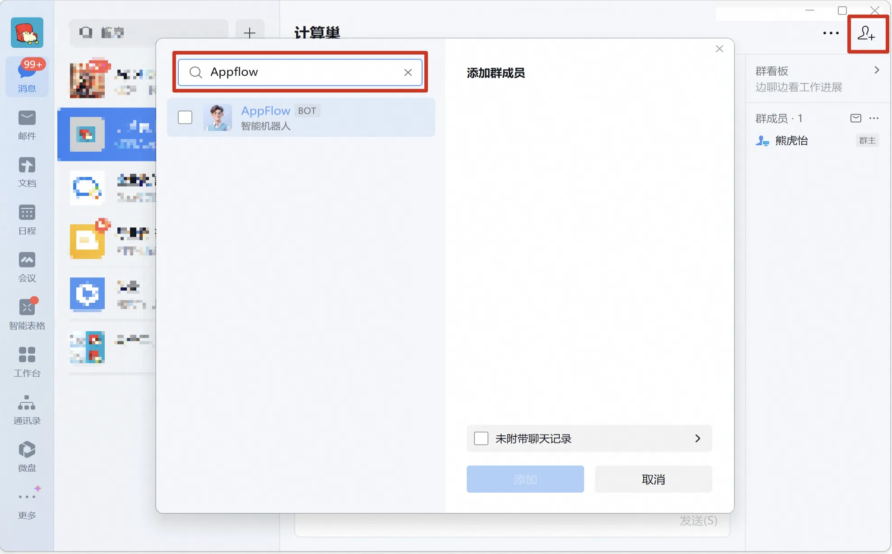

## 🌟 服务简介

OpenClaw（Clawdbot） 是一个现代化的机器人流程自动化（RPA）平台。OpenClaw（Clawdbot） 可以帮助用户自动化重复性的桌面任务，提高工作效率。OpenClaw（Clawdbot） 具有直观的用户界面和强大的自动化功能，支持多种应用场景。通过 OpenClaw（Clawdbot），您可以轻松创建、管理和执行自动化任务，无需编程经验。它还提供了丰富的集成接口，能够与其他系统和服务无缝协作。

## 🚀 部署流程

1. 访问计算巢OpenClaw（Clawdbot）社区版[部署链接](https://computenest.console.aliyun.com/service/instance/create/cn-hangzhou?type=user&ServiceId=service-249322bfe8c045798808)，按提示填写部署参数（钉钉应用和企业微信机器人配置参数请参考下文获取）：
   

2. 参数填写完成后可以看到对应询价明细，确认参数后点击**下一步：确认订单**。

3. 确认订单完成后同意服务协议并点击**立即创建**进入部署阶段。

4. 等待部署完成后进入服务实例详情页。
   

5. 点击服务地址并使用OpenClaw（Clawdbot）社区版。
   

# 📚 使用指南

## 配置钉钉机器人

### 1. 创建钉钉应用

创建钉钉应用需要钉钉账号有开发者权限。可以联系组织管理员获取钉钉开放平台的开发权限，具体操作请参见[获取开发者权限](https://open.dingtalk.com/document/orgapp/obtain-developer-permissions)。

#### 1.1 创建应用

1. 访问[钉钉开放平台](https://open-dev.dingtalk.com/)，点击**创建**。如果创建过应用但未展示应用开发指引，点击**立即开始**进入钉钉应用页面。

2. 在应用开发的左侧导航栏中，点击**钉钉应用**，在**钉钉应用**页面右上角点击**创建应用**。
   

3. 在**创建应用**面板，填写**应用名称**和**应用描述**，在**应用图标**上传图标，完成后点击**保存**。

#### 1.2 查看应用 Client ID 和 Client Secret

在左侧菜单选择**凭证与基础信息**，复制 **Client ID** 和 **Client Secret**。
   

### 2. 配置钉钉机器人

#### 2.1 配置钉钉机器人

1. 访问[钉钉应用列表](https://open-dev.dingtalk.com/fe/app)。找到刚刚创建的应用，点击应用名称进入详情页面。

2. 在**添加应用能力**页面，找到机器人卡片，点击**添加**。

   在机器人配置页面，打开**机器人配置**开关，可以参考下图完成配置。**消息接收模式**请选择 **Stream 模式**，然后单击**发布**。
   

#### 3.2 发布应用版本

应用创建完成后，如果需要将应用供企业内其他用户使用，需要发布一个版本。

1. 单击**应用开发**，在**钉钉应用**页面，点击目标应用。
   

2. 在目标应用开发导航栏，单击**版本管理与发布**，在**版本管理与发布**页面，点击**创建新版本**。进入版本详情页面，输入**应用版本号**和**版本描述**信息，选择合适的**应用可见范围**，完成后点击**保存**。并在弹窗中点击**直接发布**。
   

### 3. 在控制台配置 channel 参数

在 **计算巢控制参数** 中填入钉钉应用的 **Client ID** 和 **Client Secret**，并**创建服务实例**。

### 4. 测试机器人

服务实例创建完成后，你可以创建群聊或在已有群聊中添加机器人，并与机器人对话，查看效果。

> 更改百炼模型请参考[如何更改 OpenClaw 调用的模型](#)。

1. 在钉钉**群管理**中添加机器人。进入钉钉群**群设置**页面，点击**机器人**卡片区域，在**机器人管理**页面，点击**添加机器人**。在**添加机器人**的**搜索**文本框中输入目标机器人名称，并选中要添加的机器人。点击**添加**，完成后再点击**完成添加**。

2. 在钉钉群中 **@机器人** 进行交流互动。也可以在钉钉的搜索栏中，输入机器人名称后，在功能页检索到对应机器人，进行私聊互动。
   

## 配置企业微信机器人
1. 访问[企业微信管理后台](https://work.weixin.qq.com/wework_admin/frame#/aiHelper/create)，在左侧导航栏单击 安全与管理 > 管理工具 > 智能机器人。单击创建机器人。

2. 通过API模式创建智能机器人:

   在页面底部单击API模式创建。 分别单击Token和Encoding-AESKey后的随机获取，保存Token和Encoding-AESKey。
   

   在计算巢创建页面输入获取的Token和Encoding-AESKey，等待服务实例创建完成，回到API模式创建页面，填入URL，Token和Encoding-AESKey字段保持不变，单击创建。

   URL的格式为http://IP地址:18789/webhooks/wecom。IP地址需要替换为OpenClaw服务器的IP地址。
   

3. 方案验证:
   在群聊中点击添加群成员，搜索创建完成的机器人名称，加入群聊
   

   在已添加机器人的群中@机器人即可实现流式对话，效果如下：
   

# 如何使用OpenClaw（Clawdbot）
更多用法请参考OpenClaw（Clawdbot）[官网文档](https://docs.clawd.bot/)。