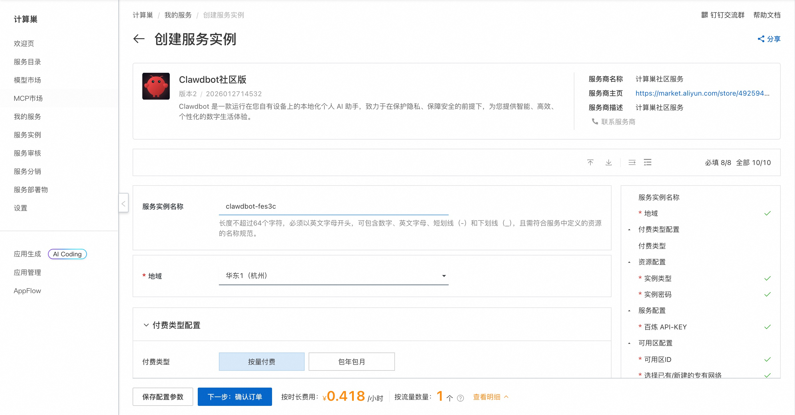
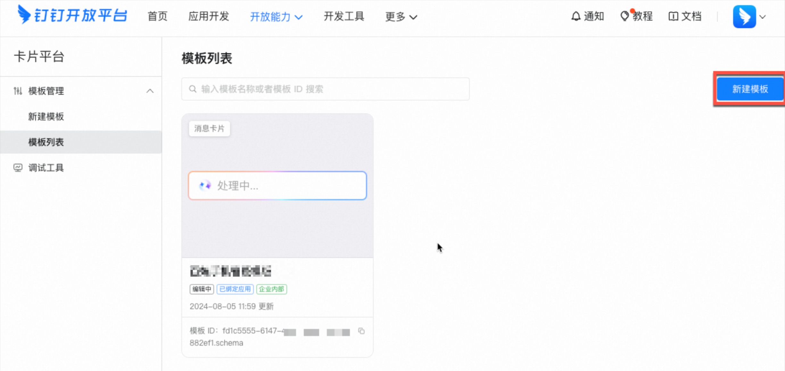
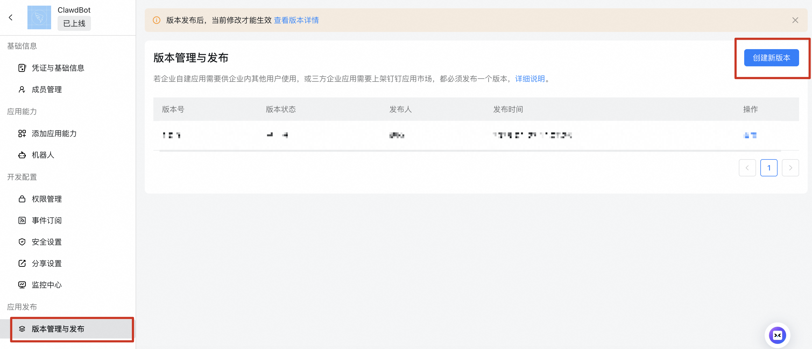
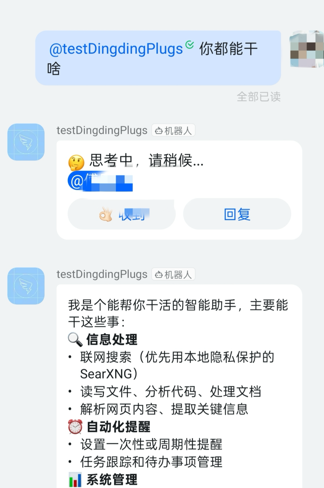
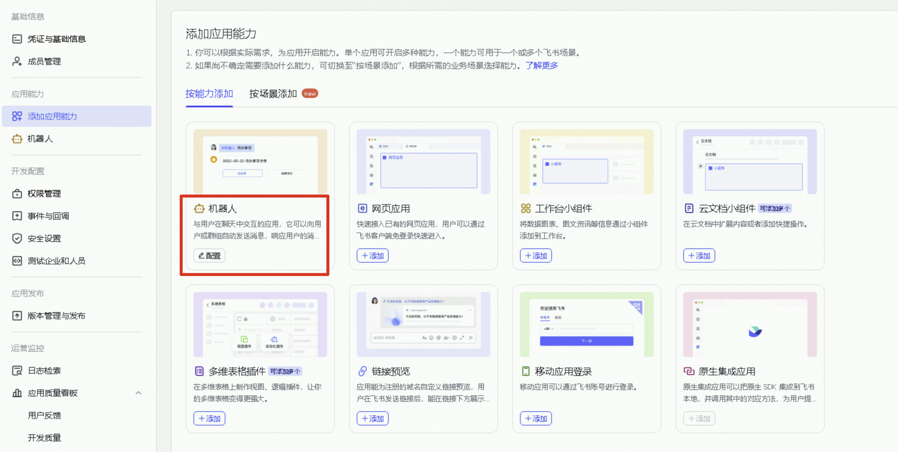
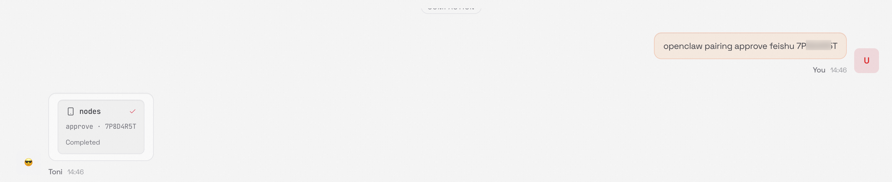
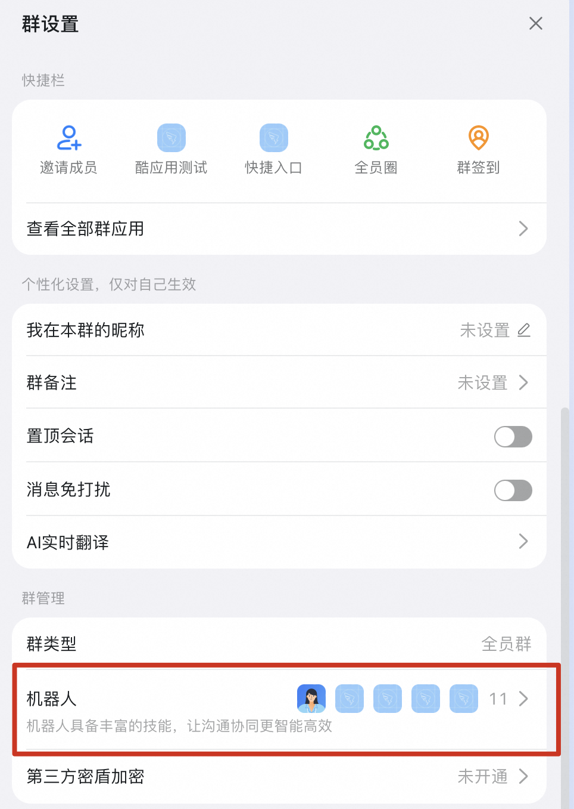
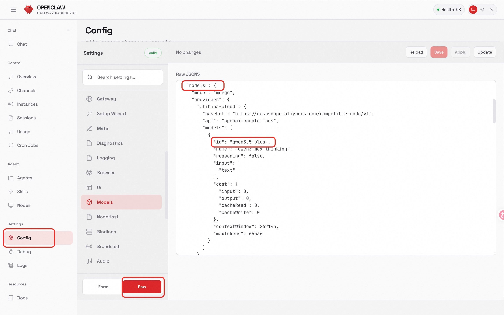

## 🌟 服务简介

Clawdbot 是一个现代化的机器人流程自动化（RPA）平台。Clawdbot 可以帮助用户自动化重复性的桌面任务，提高工作效率。Clawdbot 具有直观的用户界面和强大的自动化功能，支持多种应用场景。通过 Clawdbot，您可以轻松创建、管理和执行自动化任务，无需编程经验。它还提供了丰富的集成接口，能够与其他系统和服务无缝协作。

## 🚀 部署流程

1. 访问计算巢Clawdbot社区版[部署链接](https://computenest.console.aliyun.com/service/instance/create/cn-hangzhou?type=user&ServiceId=service-249322bfe8c045798808)，按提示填写部署参数：
   

2. 参数填写完成后可以看到对应询价明细，确认参数后点击**下一步：确认订单**。

3. 确认订单完成后同意服务协议并点击**立即创建**进入部署阶段。

4. 等待部署完成后进入服务实例详情页。
   

5. 点击服务地址并使用Clawdbot社区版。
   

# 📚 使用指南

## 如何配置钉钉机器人使用
### 创建钉钉应用
创建钉钉应用需要您的钉钉账号有开发者权限。您可以联系您的组织管理员获取钉钉开放平台的开发权限，具体操作请参见获取开发者权限。

#### 1. 创建应用
1. 访问钉钉开放平台，点击创建。如果创建过应用但未展示应用开发指引，点击立即开始进入钉丁应用页面。
2. 在应用开发的左侧导航栏中，点击钉钉应用，在钉钉应用页面右上角点击创建应用。
   

3. 在创建应用面板，填写应用名称和应用描述，上传应用图标，完成后点击保存。

#### 2. 查看应用 Client ID 和 Client Secret
在左侧菜单选择凭证与基础信息，复制 Client ID 和 Client Secret，用于在计算巢创建服务时填写。
   

#### 3. 创建消息卡片
钉钉机器人通过卡片消息支持流式返回结果，您需要创建卡片模板供消息发送使用。
1. 访问[卡片平台](https://open-dev.dingtalk.com/fe/card)，点击新建模板。
   

2. 在创建模板输入框，填入模板信息，单击创建。
   * 卡片类型：消息卡片
   * 卡片模板场景：AI 卡片
   * 关联应用：您在之前步骤创建的钉钉应用
3. 在模拟编辑页面，不要使用预设模板，不需要进行任何额外操作，直接保存并发布模板。然后点击返回模板列表页面。
   

4. 复制模板ID，用于创建计算巢服务使用。
   

#### 4. 授予应用发送卡片消息权限
创建卡片后，您需要给应用授予发送卡片消息的权限。
1. 访问[钉钉应用列表](https://open-dev.dingtalk.com/fe/app)。找到刚刚创建的应用，点击应用名称进入详情页面。
2. 在左侧菜单选择开发配置 > 权限管理，在左侧搜索框分别输入**Card.Streaming.Write** 和**Card.Instance.Write**，并在操作列点击申请权限。
   

#### 5. 创建钉钉机器人连接流
1. 在服务部署页面，启用钉钉应用连接Moltbot，填写上述获取的钉钉消息卡片模版ID、ClientID和Client Secret
   

2. 等待部署完成后进入服务实例详情页。在页面上可以获取到**Webhook Url**，复制并保存
   

#### 6. 配置钉钉机器人
有了Webhook地址后，接下来您可以在钉钉应用中配置机器人来回答用户问题了。

1. 访问[钉钉应用列表](https://open-dev.dingtalk.com/fe/app)。找到刚刚创建的应用，点击应用名称进入详情页面。
在添加应用能力页面，找到机器人卡片，点击添加。

2. 在机器人配置页面，打开机器人配置开关，您可以参考下图完成配置。
   

3. 消息接收模式请选择**HTTP模式**，消息接收地址为刚刚的 WebhookUrl。然后点击发布。
   

#### 7. 发布钉钉应用
应用创建完成后，如果需要将应用供企业内其他用户使用，需要发布一个版本。
1. 点击应用开发，在钉钉应用页面，点击目标应用。
   

2. 在目标应用开发导航栏，点击版本管理与发布，在版本管理与发布页面，点击创建新版本。进入版本详情页面，输入应用版本号和版本描述信息，选择合适的应用可见范围，完成后点击保存。并在弹窗中点击直接发布。
   

   

3. 测试机器人
你可以创建群聊或在已有群聊中添加机器人，并与机器人对话，查看效果。
   

   

在钉钉群中@机器人或直接进行私聊，进行交流互动。
   

## 如何使用Clawdbot
更多用法请参考Clawdbot[官网文档](https://docs.clawd.bot/)。